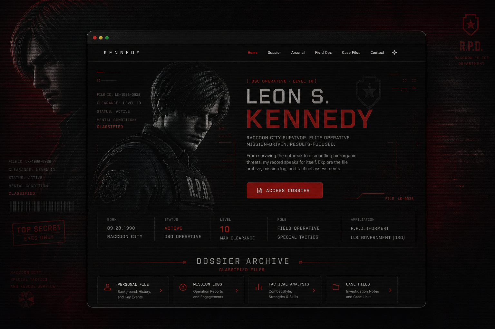

<div align="center">

# Leon S. Kennedy — DSO Field Dossier

### *A character-driven portfolio archive. Classified.*

[](https://leon-kennedy-portfolio-archive.vercel.app)
[](https://github.com/TheAlgo7/leon-kennedy-portfolio-archive)
[](https://github.com/TheAlgo7/leon-kennedy-portfolio-archive)
[](https://thealgothrim.com)

</div>



This is the **2024 portfolio archive** — a preserved showcase of the design system, layout patterns, and interaction work that preceded the current Algothrim build. Rather than deleting it, it lives here as a standalone site: themed as a classified DSO field dossier for Leon Scott Kennedy from the *Resident Evil* franchise. Built with zero framework overhead — pure Vanilla HTML, CSS, and JavaScript with Swiper.js for the carousel components. Dark mode is on by default. Everything is intentional.

## Sections

| Section | Label | What It Does |
| --- | --- | --- |
| Home | `Home` | Hero — name, rank, operative summary |
| About | `Dossier` | Case background, clearance level, stat callouts |
| Skills | `Arsenal` | Accordion skill groups with animated fill bars |
| Qualification | `History` | Tabbed Academic / Operational timeline |
| Services | `Field Ops` | Three specialisation cards with modal detail views |
| Portfolio | `Case Files` | Swiper carousel — mission reports |
| CTA Banner | — | Outbreak alert strip with contact CTA |
| Testimonials | `Field Reviews` | Character assessments — Ada Wong, Claire Redfield, Hunnigan |
| Contact | `Contact` | DSO encrypted channel form |
| Footer | — | `KENNEDY` — Agent. Survivor. Asset. |

## Features

- **Dark mode by default** — Leon's dossier was never meant to be read in broad daylight
- **Name glitch animation** — Rare, subtle. Fires every ~9 seconds on the hero title
- **Skill bars animate in** — Fill from zero on load via `max-width` CSS trick
- **Staggered hero entrance** — Home section elements fade up sequentially
- **Scanline atmosphere** — Subtle horizontal scanline overlay across the full viewport
- **Button glow on hover** — Red glow on primary CTAs
- **Active nav pulse** — Current section link glows with a slow red text-shadow loop
- **Services modals** — Click-to-expand field op cards
- **Portfolio carousel** — Swiper.js slider, loop mode
- **Testimonial carousel** — Dynamic bullet pagination, grab cursor
- **Theme toggle** — Dark / Light switcher, saved to localStorage
- **Fully responsive** — Mobile-first, hamburger nav on small screens

## Stack

| Layer | Technology |
| --- | --- |
| Markup | Semantic HTML5 |
| Styling | Vanilla CSS — HSL custom properties, CSS animations |
| Slider | [Swiper.js](https://swiperjs.com/) |
| Icons | [Unicons 4.0.8](https://iconscout.com/unicons) (CDN) |
| Hosting | [Vercel](https://vercel.com/) |

## Design Language

- **Near-black dark mode by default.** Body sits at `hsl(0, 6%, 8%)` — almost pure black with the faintest red undertone. The primary red (`#cc0000`) cuts through it with full contrast.
- **Blood red accent system.** `--first-color: #cc0000` for buttons, icons, active states. `--first-color-second: hsl(0, 75%, 17%)` for the footer and CTA banner — a deep maroon that reads as intentional, not dark-mode-lazy.
- **Character-driven copy.** Every line is written from Leon's perspective. The "Human Cost" skill group (Survival Instinct: Unmeasurable, Normal Life Maintained: 0%) is a deliberate character beat.
- **Tactical dossier framing.** `[REDACTED]` in the stat block. "City was destroyed" as an academic record entry. The format communicates before the words do.
- **Subtle atmosphere over spectacle.** Scanlines, a rare glitch on the title, staggered fade-ins. None of it demands attention. All of it adds up.

## Character Reference

Leon Scott Kennedy — born July 31, 1977. Entered Raccoon City on his first day as an RPD rookie. The city fell. He didn't. Recruited by the U.S. government in the aftermath and spent the next two decades as a blade pointed at bioterrorism threats that no one else could solve. The dossier is built around that arc: rookie → weapon → survivor asking what it cost.

<details>
<summary>Project Structure</summary>

```text
leon-kennedy-portfolio-archive/
├── index.html
├── assets/
│   ├── css/
│   │   ├── archive.css              ← Theme, layout, animations
│   │   └── swiper-bundle.min.css
│   ├── js/
│   │   ├── archive.js               ← Nav, skills, modals, theme toggle, Swiper
│   │   ├── swiper-bundle.min.js
│   │   └── consent.js
│   └── img/
│       └── archive/
│           ├── favicon.svg
│           ├── banner-profile.png
│           ├── about.jpg
│           └── portfolio1–3.jpg
├── RESKIN_BRIEF.md
├── vercel.json
└── README.md
```

</details>

<details>
<summary>Quick Start</summary>

No build step.

```bash
git clone https://github.com/TheAlgo7/leon-kennedy-portfolio-archive.git
cd leon-kennedy-portfolio-archive
```

Open directly:

```bash
start index.html   # Windows
open index.html    # macOS
```

Or serve locally:

```bash
npx serve .
```

</details>

<div align="center">

Designed & developed by **[The Algothrim](https://thealgothrim.com)**

</div>
